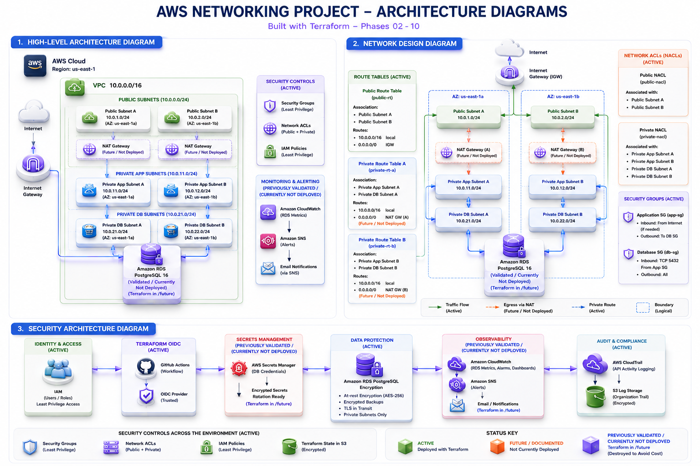

# AWS Enterprise Networking Foundation

Production-inspired AWS networking infrastructure built with Terraform to demonstrate secure cloud architecture, Infrastructure as Code (IaC), network security, database integration, and operational engineering practices.

---

## Project Overview

This project implements an AWS enterprise networking foundation using Terraform.

The active Terraform configuration builds a multi-AZ network architecture with public and private subnets, routing, security groups, Network ACLs, and optional cost-sensitive infrastructure such as a NAT Gateway and bastion host.

Additional Terraform configurations under the `future/` directory document later-stage database and enterprise-hardening work, including Amazon RDS PostgreSQL, AWS Secrets Manager, IAM least-privilege access, CloudWatch monitoring, and SNS alerting.

The project was developed to strengthen practical experience in Cloud Engineering, Cloud Database Engineering, Database Reliability Engineering (DBRE), and cloud infrastructure operations.

---

## Objectives

The primary goals of this project are to:

* Build AWS infrastructure using Terraform
* Design secure VPC networking following AWS best practices
* Implement a multi-AZ public and private subnet architecture
* Apply layered network security using Security Groups and Network ACLs
* Design optional NAT Gateway and bastion host deployment patterns
* Integrate a private Amazon RDS PostgreSQL architecture
* Implement secrets management and IAM least-privilege controls
* Add monitoring and alerting for database infrastructure
* Practice enterprise-style infrastructure documentation
* Create a portfolio project demonstrating practical cloud engineering skills

---

## Architecture

The project is organized into two architectural layers.

### Core Networking Infrastructure

The active Terraform configuration under `terraform/` includes:

* Amazon VPC
* Public subnets
* Private subnets
* Multi-AZ network design
* Internet Gateway
* Public and private route tables
* Security Groups
* Network ACLs
* Optional NAT Gateway
* Optional bastion host

### Enterprise and Database Extensions

Additional Terraform configurations under `future/` demonstrate:

* Amazon RDS PostgreSQL
* Private database subnet design
* Encrypted RDS storage
* AWS Secrets Manager
* IAM least-privilege secret access
* Amazon CloudWatch RDS monitoring
* Amazon SNS alerting
* Supporting variables, locals, and outputs

These files are retained as staged infrastructure configuration and are not part of the currently deployed networking baseline. The Phase 08 RDS PostgreSQL instance was previously deployed and validated, then destroyed to avoid ongoing AWS charges. The RDS monitoring, SNS, Secrets Manager, IAM, and credential-integration resources remain staged under `future/` for future integration. The `future/` directory is not intended to operate as an independent Terraform root module in its current repository location.

### Architecture Diagram



---

## Technologies Used

### Cloud Platform

* Amazon Web Services (AWS)

### Infrastructure as Code

* Terraform
* HashiCorp AWS Provider

### Networking

* Amazon VPC
* Public and private subnets
* Route tables
* Internet Gateway
* Network ACLs
* Security Groups
* NAT Gateway

### Database

* Amazon RDS for PostgreSQL

### Security

* AWS Identity and Access Management (IAM)
* AWS Secrets Manager
* RDS encryption at rest
* Security Groups
* Network ACLs

### Monitoring and Alerting

* Amazon CloudWatch
* Amazon SNS

### Development and Version Control

* Git
* GitHub
* PowerShell
* Visual Studio Code

---

## Key Features

### Core Infrastructure

* Terraform-managed AWS networking foundation
* Multi-AZ VPC architecture
* Public and private subnet segmentation
* Internet routing for public workloads
* Isolated private subnet routing
* Layered Security Group and Network ACL controls
* Optional NAT Gateway deployment controlled through Terraform
* Optional bastion host deployment controlled through Terraform
* Reusable variables, locals, and outputs

### Enterprise Extensions

Staged and previously validated enterprise extensions include:

* Private Amazon RDS PostgreSQL architecture, previously deployed and validated during Phase 08
* Encrypted RDS storage configuration
* AWS Secrets Manager credential integration
* Least-privilege IAM policy for RDS secret retrieval
* CloudWatch RDS monitoring configuration
* Amazon SNS alerting configuration

---

## Repository Structure

```text
.
├── docs/
│   ├── 01-project-initialization.md
│   ├── 02-custom-vpc.md
│   ├── 03-security-groups.md
│   ├── 04-network-acls.md
│   ├── 05-multi-az-networking.md
│   ├── 06_nat_gateway.md
│   ├── 07_bastion.md
│   ├── 08_rds_deploy.md
│   ├── 09_rds_monitoring.md
│   ├── 10_sec_hardening.md
│   ├── deployment-guide.md
│   ├── networking-notes.md
│   └── troubleshooting-guide.md
├── future/
│   ├── data_secrets.tf
│   ├── iam_secrets_access.tf
│   ├── locals_rds.tf
│   ├── outputs_rds.tf
│   ├── rds.tf
│   ├── rds_monitoring.tf
│   ├── secrets.tf
│   ├── sns.tf
│   └── variables_rds.tf
├── images/
│   └── AWS_Networking_Project_Architectural_Diagram.png
├── screenshots/
├── terraform/
│   ├── .terraform.lock.hcl
│   ├── bastion.tf
│   ├── locals.tf
│   ├── nat_gateway.tf
│   ├── network_acls.tf
│   ├── outputs.tf
│   ├── providers.tf
│   ├── security_groups.tf
│   ├── terraform.tfvars.example
│   ├── variables.tf
│   ├── versions.tf
│   └── vpc.tf
├── .gitignore
└── README.md
```

Local Terraform working files such as `.terraform/` and `terraform.tfvars` are intentionally excluded from version control.

---

## Documentation

| Document                                                    | Description                                                        |
| ----------------------------------------------------------- | ------------------------------------------------------------------ |
| [Project Initialization](docs/01-project-initialization.md) | Project purpose, prerequisites, tools, and development environment |
| [Custom VPC](docs/02-custom-vpc.md)                         | VPC, subnet, routing, and Internet Gateway implementation          |
| [Security Groups](docs/03-security-groups.md)               | Stateful workload security controls                                |
| [Network ACLs](docs/04-network-acls.md)                     | Subnet-level network security controls                             |
| [Multi-AZ Networking](docs/05-multi-az-networking.md)       | Multi-Availability Zone architecture                               |
| [NAT Gateway](docs/06_nat_gateway.md)                       | Optional private-subnet Internet access design                     |
| [Bastion Host](docs/07_bastion.md)                          | Optional administrative access architecture                        |
| [RDS Deployment](docs/08_rds_deploy.md)                     | Private Amazon RDS PostgreSQL deployment                           |
| [RDS Monitoring](docs/09_rds_monitoring.md)                 | CloudWatch monitoring and alerting                                 |
| [Security Hardening](docs/10_sec_hardening.md)              | Secrets Manager, IAM, encryption, and hardening controls           |
| [Deployment Guide](docs/deployment-guide.md)                | Step-by-step Terraform deployment instructions                     |
| [Troubleshooting Guide](docs/troubleshooting-guide.md)      | Common deployment issues and resolutions                           |
| [Networking Notes](docs/networking-notes.md)                | Supplemental networking observations and reference notes           |

---

## Deployment

The active infrastructure is deployed from the `terraform/` directory.

High-level deployment workflow:

1. Clone the repository.
2. Configure AWS credentials.
3. Review `terraform.tfvars.example`.
4. Create a local `terraform.tfvars` file if custom values are required.
5. Initialize Terraform.
6. Validate the configuration.
7. Review the Terraform execution plan.
8. Apply the infrastructure.
9. Validate the deployed AWS resources.
10. Destroy training resources when no longer required.

Example:

```bash
cd terraform

terraform init
terraform fmt -check
terraform validate
terraform plan
terraform apply
```

When finished:

```bash
terraform destroy
```

Detailed instructions are available in the [Deployment Guide](docs/deployment-guide.md).

---

## Security

The project uses defense-in-depth principles across the network and database architecture.

Core networking controls include:

* Public and private subnet separation
* Security Groups
* Network ACLs
* Controlled Internet routing
* Optional bastion access
* Private workload placement

Enterprise-hardening designs retained under `future/` include:

* Private Amazon RDS PostgreSQL configuration, previously deployed and validated during Phase 08 and later destroyed
* Encrypted RDS storage configuration
* AWS Secrets Manager integration for database credentials
* IAM least-privilege policy for secret retrieval
* CloudWatch RDS monitoring configuration
* Amazon SNS alerting configuration

These enterprise-hardening resources are not part of the currently deployed networking baseline. Except for the previously validated Phase 08 RDS deployment, they are retained as staged Terraform configuration for future integration.

Sensitive local configuration is excluded from Git through `.gitignore`, including:

```text
terraform/terraform.tfvars
terraform/.terraform/
```

A sanitized `terraform.tfvars.example` file is provided for configuration reference.

---

## Cost Optimization

The project is designed as a training and portfolio environment rather than a continuously running production workload.

Cost controls include:

* NAT Gateway deployment disabled by default
* Optional bastion host deployment
* Small resource sizes where appropriate
* Minimal database storage allocation during testing
* Infrastructure destruction after validation
* Separation of enterprise extensions from the core networking deployment

This allows the architecture to demonstrate production-inspired patterns without requiring all cost-generating resources to run continuously.

---

## Validation and Evidence

The project uses Terraform validation and AWS resource verification to confirm infrastructure behavior.

Validation activities include:

* `terraform fmt`
* `terraform validate`
* `terraform plan`
* Terraform apply verification
* AWS VPC and subnet inspection
* Route table verification
* Security Group verification
* Network ACL verification
* RDS deployment validation during Phase 08 before resource teardown
* CloudWatch RDS monitoring configuration review for staged future deployment
* Terraform destroy validation

Additional screenshots can be stored under:

```text
screenshots/
```

---

## Lessons Learned

This project provided hands-on experience with:

* Terraform configuration and state behavior
* AWS VPC architecture
* Multi-AZ network design
* Public and private subnet segmentation
* Routing and Internet connectivity
* Network security implementation
* Optional infrastructure controlled through Terraform variables
* Amazon RDS PostgreSQL deployment
* Secrets management
* IAM least-privilege design
* CloudWatch monitoring
* SNS alerting
* Infrastructure troubleshooting
* Enterprise-style technical documentation
* Cost-aware cloud infrastructure design

---

## Future Improvements

Potential future enhancements include:

* Add AWS Config
* Add Amazon GuardDuty
* Add GitHub Actions Terraform validation
* Add automated Terraform plan checks for pull requests
* Add Infrastructure as Code security scanning
* Introduce remote Terraform state
* Add remote state locking
* Add a CloudWatch monitoring dashboard
* Create reusable Terraform modules
* Add additional architecture diagrams
* Expand deployment screenshots and validation evidence

---

## Portfolio Context

This project was built as part of a Cloud Engineering and Database Reliability Engineering portfolio demonstrating practical AWS infrastructure, Terraform, network security, database integration, operational monitoring, and technical documentation.
